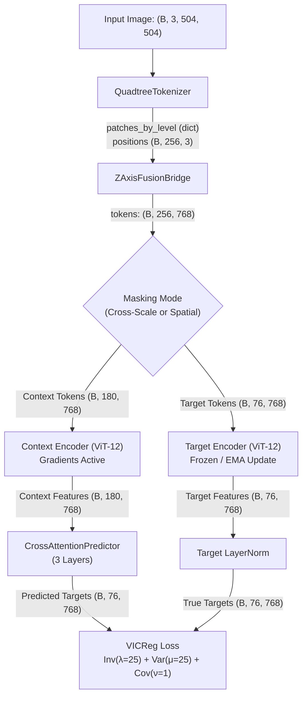

# Comprehensive Learning & Architecture Guide: QuadTree-JEPA

Welcome to the comprehensive learning roadmap for **QuadTree-JEPA** (Joint-Embedding Predictive Architecture with Hierarchical QuadTree Tokenization).

This guide is designed to take you from first principles to mastering every component of the architecture, the mathematical concepts underpinning it, the exact execution flow, and every critical file and function in the repository.

---

## 📑 Table of Contents
1. [Core Vision & The Problem It Solves](#1-core-vision--the-problem-it-solves)
2. [Prerequisites & Supporting Topics Curriculum](#2-prerequisites--supporting-topics-curriculum)
3. [Repository Structure & Reading Map](#3-repository-structure--reading-map)
4. [Deep Dive: Architecture & Most Important Classes](#4-deep-dive-architecture--most-important-classes)
5. [Complete Flow of Execution (Lifecycle)](#5-complete-flow-of-execution-lifecycle)
6. [The Mathematical Objective Functions](#6-the-mathematical-objective-functions)
7. [The Evolutionary Journey & Hard-Earned Insights (V1 → V4)](#7-the-evolutionary-journey--hard-earned-insights-v1--v4)
8. [Hands-On Code Walkthrough & Interactive Exercises](#8-hands-on-code-walkthrough--interactive-exercises)

---

## 1. Core Vision & The Problem It Solves

### The Problem: Quadratic Scaling in Standard Vision Transformers
In a standard Vision Transformer (ViT-Base), a $512 \times 512$ image is divided into non-overlapping $16 \times 16$ patches.
- Total patches: $(512 / 16) \times (512 / 16) = 32 \times 32 = 1,024$ tokens.
- Multi-Head Self-Attention scales **quadratically** with sequence length $N$: $\mathcal{O}(N^2 \cdot D)$.
- For $N = 1,024$, attention matrix entries per layer = $1,024^2 \approx 1,048,576$ elements.
- For fine-grained tasks (e.g. bird plumage details in CUB-200 or microscopic plant lesions), $16 \times 16$ patches blur crucial minute features. If you drop patch size to $8 \times 8$ to capture fine details:
  - $(512 / 8)^2 = 4,096$ tokens.
  - Attention matrix entries per layer = $4,096^2 \approx 16.7$ million elements! This causes Out-Of-Memory (OOM) errors even on high-end GPUs.

### The Solution: QuadTree-JEPA
QuadTree-JEPA achieves **fine-grained resolution ($8 \times 8$ patches) at a fraction of the compute cost** by exploiting spatial sparsity:
1. **Hierarchical QuadTree Tokenization**: The image is recursively decomposed based on local variance. Smooth, uniform areas (sky, background blur, flat leaves) remain coarse ($64 \times 64$ or $32 \times 32$), while visually complex, high-entropy areas (beaks, eyes, feathers, fungal lesions) are split down to $8 \times 8$.
2. **Fixed Token Budget ($K = 256$)**: Regardless of image size or texture complexity, token allocation is prioritized such that **every image outputs exactly 256 tokens**.
   - $256^2 = 65,536$ attention operations per layer — **$16\times$ cheaper than uniform $16 \times 16$ and $256\times$ cheaper than uniform $8 \times 8$!**
3. **Joint-Embedding Predictive Architecture (JEPA)**: Instead of reconstructing raw RGB pixels (like Masked Autoencoders / MAE), which wastes capacity hallucinating high-frequency noise, QuadTree-JEPA learns semantic abstractions by predicting the **latent representations** of target tokens from context tokens.

---

## 2. Prerequisites & Supporting Topics Curriculum

Before diving into the code, ensure you are comfortable with these core concepts:

### Topic A: Vision Transformers (ViT) & Multi-Head Attention
- **Concept**: Images treated as sequences of flattened patch vectors projected into an embedding space $\mathbb{R}^D$, added with positional embeddings, and processed by stacked Transformer blocks (LayerNorm $\rightarrow$ Multi-Head Attention $\rightarrow$ Residual $\rightarrow$ LayerNorm $\rightarrow$ MLP $\rightarrow$ Residual).
- **Key Equations**:
  $$\text{Attention}(Q, K, V) = \text{Softmax}\left(\frac{Q K^T}{\sqrt{d_k}}\right) V$$
- **Recommended Reading**: *Dosovitskiy et al., "An Image is Worth 16x16 Words: Transformers for Image Recognition at Scale" (ICLR 2021).*

### Topic B: Self-Supervised Learning (SSL) Paradigms
- **Contrastive Learning (SimCLR, MoCo)**: Pushes representations of augmented views together while pushing negative pairs apart. Downside: requires massive batch sizes or memory banks to prevent collapse.
- **Generative / Masked Modeling (MAE, SimMIM)**: Masks image patches and reconstructs raw pixels using an MSE loss. Downside: forces model to spend parameters modeling high-frequency pixel noise and lighting rather than semantic features.
- **Joint-Embedding Predictive Architecture (JEPA, DINO, I-JEPA)**: Predicts representations in latent feature space. Eliminates pixel reconstruction and negative pair mining.
- **Recommended Reading**: *Assran et al., "Self-Supervised Learning from Images with a Joint-Embedding Predictive Architecture" (CVPR 2023 - Meta AI).*

### Topic C: Non-Contrastive Representation Collapse & VICReg
- **The Collapse Trap**: In a non-contrastive network with no negative pairs, if the model simply outputs a constant zero vector $\mathbf{z} = \mathbf{0}$ for every image, the prediction error $\text{MSE}(\hat{\mathbf{z}}, \mathbf{z}) = 0$. This is trivial representation collapse.
- **VICReg Solution**: Regularizes the latent space with three criteria:
  1. **Variance ($\mu$)**: Forces each feature dimension to have a standard deviation above a threshold (prevents all tokens from collapsing to a single vector).
  2. **Invariance ($\lambda$)**: Minimizes prediction MSE between context prediction and target representation.
  3. **Covariance ($\nu$)**: Penalizes cross-correlation between different feature channels, forcing dimensions to encode independent, orthogonal visual properties.
- **Recommended Reading**: *Bardes, Ponce, LeCun, "VICReg: Variance-Invariance-Covariance Regularization for Self-Supervised Learning" (ICLR 2022).*

### Topic D: Spatial QuadTrees & Continuous Coordinate Frames
- A QuadTree is a 2D spatial data structure where each non-leaf node has exactly 4 children.
- In image processing, a node is split if its content exceeds a heterogeneity threshold (e.g. variance).
- When mixing tokens from different scales (e.g. $64\times 64$ patch vs $8\times 8$ patch), how does a transformer know where they belong?
  - **Spatial 2D Coordinates $(x, y)$**: Continuous center coordinates encoded via Sinusoidal Fourier features.
  - **Scale Level $z \in \{0, 1, 2, 3\}$**: Discrete hierarchical level encoded via a learned scale embedding table.

### Topic E: Teacher-Student Networks & Exponential Moving Average (EMA)
- In JEPA, the target representations are produced by a **Target Encoder**.
- To prevent the target from drifting wildly and creating non-stationary targets, the target encoder parameters $\theta_{\text{target}}$ are updated as an exponential moving average (EMA) of the online context encoder $\theta_{\text{context}}$:
  $$\theta_{\text{target}} \leftarrow m \cdot \theta_{\text{target}} + (1 - m) \cdot \theta_{\text{context}}$$
- With momentum $m \in [0.996, 0.999]$, the target encoder acts as a stable, slow-moving teacher.

---

## 3. Repository Structure & Reading Map

To learn the codebase effectively, follow this specific reading order:

```text
vit-pytorch-main/
│
├── vit_pytorch/
│   └── vit.py                  [STEP 1: The Backbone Transformer]
│
├── quadtree_jepa.py            [STEP 2: The Core Model & Tokenizer]
│
├── train_and_evaluate_cub.py   [STEP 3: The Complete Training Pipeline]
│
├── eval_knn.py                 [STEP 4: Rapid Validation via K-NN]
│
├── benchmark_label_efficiency.py [STEP 5: Label Efficiency Benchmarking]
│
├── mods.md                     [STEP 6: Architecture Evolution & Audits]
└── knowledgebank.md            [STEP 7: Comprehensive Knowledge Bank]
```

### Recommended Study Path:
1. **Start with [`vit_pytorch/vit.py`](file:///c:/Users/Prithvi%20S/OneDrive/Documents/ALL%20PROJECTS/big%20dih%20shi/demo/vit-pytorch-main/vit_pytorch/vit.py)**:
   - Understand `Attention`, `FeedForward`, `Transformer`, and `ViT`.
   - Pay special attention to `DropPath` (Stochastic Depth) and `return_layer_outputs`.
2. **Move to [`quadtree_jepa.py`](file:///c:/Users/Prithvi%20S/OneDrive/Documents/ALL%20PROJECTS/big%20dih%20shi/demo/vit-pytorch-main/quadtree_jepa.py)**:
   - Understand `QuadtreeTokenizer`: how an image is split into 4 levels to yield exactly 256 tokens without CPU sync.
   - Understand `ZAxisFusionBridge`: how different patch resolutions are projected to a unified dimension $D=768$ and enriched with $(x, y, z)$ positional embeddings.
   - Understand `PredictorBlock` and `CrossAttentionPredictor`.
   - Understand `ScaleAwareAttentivePool`: how tokens are pooled using scale level biases.
   - Understand `QuadtreeJEPA` and `QuadtreeClassifier`.
3. **Inspect [`train_and_evaluate_cub.py`](file:///c:/Users/Prithvi%20S/OneDrive/Documents/ALL%20PROJECTS/big%20dih%20shi/demo/vit-pytorch-main/train_and_evaluate_cub.py)**:
   - Understand `CUB200Dataset` and why augmentations must preserve variance.
   - Trace `run_pretraining`: forward pass, VICReg loss calculations, gradient scaling, EMA target update.
   - Trace `extract_cub_features`: multi-layer feature extraction and caching.
   - Trace `evaluate_frozen_probe` (Phase 2A) and `run_finetuning` (Phase 2B with differential learning rates).
4. **Review [`mods.md`](file:///c:/Users/Prithvi%20S/OneDrive/Documents/ALL%20PROJECTS/big%20dih%20shi/demo/vit-pytorch-main/mods.md)**:
   - Read the architectural bug-fixes and design modifications from V1 through V4.

---

## 4. Deep Dive: Architecture & Most Important Classes

Here is an in-depth breakdown of each core class, its input/output shapes, and what it does under the hood.



---

### Class 1: `QuadtreeTokenizer` (`quadtree_jepa.py:L20-L192`)
**Role**: Converts a continuous RGB image into a hierarchical multi-scale set of patches using local luminance variance.

- **Deterministic Budget ($K = 256$ tokens total)**:
  - **Level 0 ($64 \times 64$)**: 64 total patches $\rightarrow$ split 44 into Level 1, **keep 20 coarse background tokens**.
  - **Level 1 ($32 \times 32$)**: $44 \times 4 = 176$ patches $\rightarrow$ split 16 into Level 2, **keep 160 mid-scale tokens**.
  - **Level 2 ($16 \times 16$)**: $16 \times 4 = 64$ patches $\rightarrow$ split 4 into Level 3, **keep 60 fine-scale tokens**.
  - **Level 3 ($8 \times 8$)**: $4 \times 4 = 16$ patches $\rightarrow$ **keep all 16 ultra-fine tokens**.
  - **Sum**: $20 + 160 + 60 + 16 = \mathbf{256}$ tokens.
- **Why Fully Vectorized?**:
  In V2, coordinates were extracted using Python loops and `.item()` calls. This caused 512 PCIe synchronization barriers per image, stalling the GPU. V3/V4 uses `torch.unfold`, `torch.topk`, and pure tensor index masks on CUDA with **zero CPU-GPU sync**.
- **Signature**:
  ```python
  patches_by_level, positions = tokenizer(image)
  ```
  - `image`: Tensor `(3, H, W)` or `(1, 3, H, W)`
  - `patches_by_level`: Dictionary containing:
    - `0`: Tensor `(20, 3 * 64 * 64) = (20, 12288)`
    - `1`: Tensor `(160, 3 * 32 * 32) = (160, 3072)`
    - `2`: Tensor `(60, 3 * 16 * 16) = (60, 768)`
    - `3`: Tensor `(16, 3 * 8 * 8) = (16, 192)`
  - `positions`: Tensor `(256, 3)` where each row is `[X_center, Y_center, Z_scale_level]`.

---

### Class 2: `ZAxisFusionBridge` (`quadtree_jepa.py:L194-L255`)
**Role**: Projects multi-resolution patches into a uniform latent dimension $D=768$ and injects 3D spatial-scale coordinates.

- **Projections**: 4 separate `nn.Linear` layers:
  - Level 0: $12288 \rightarrow 768$
  - Level 1: $3072 \rightarrow 768$
  - Level 2: $768 \rightarrow 768$
  - Level 3: $192 \rightarrow 768$
- **Positional Encoding ($X, Y, Z$)**:
  - **2D Continuous Coordinates $(X, Y)$**: Sinusoidal frequencies ($\omega_k = \exp(-k \ln(10000) / (D/4))$).
    $$\text{PE}_{(X, Y)} = [\sin(\omega X), \cos(\omega X), \sin(\omega Y), \cos(\omega Y)] \in \mathbb{R}^{768}$$
  - **1D Scale Level $Z \in \{0, 1, 2, 3\}$**: Learned embedding `nn.Embedding(4, 768)`.
  - **Output**: $\mathbf{x}_{\text{token}} = \text{Linear}_z(\text{patch}) + \text{PE}_{(X, Y)} + \text{Embed}(Z) \in \mathbb{R}^{256 \times 768}$.

---

### Class 3: `ViT` & `Transformer` (`vit_pytorch/vit.py:L96-L163`)
**Role**: The primary feature encoder backbone.

- **Topology**: Standard ViT-Small/Base configuration:
  - `dim = 768`
  - `depth = 12` Transformer layers
  - `heads = 12` (head dimension = $768 / 12 = 64$)
  - `mlp_dim = 2048`
  - `dropout = 0.1`
- **Key Enhancements in this Codebase**:
  1. **DropPath (Stochastic Depth)**: Linear schedule $0.0 \rightarrow 0.1$ across layers 1 to 12. During training, entire residual branches are randomly dropped with probability $p_l = 0.1 \times \frac{l}{11}$. At test/eval time, DropPath is disabled.
  2. **Multi-Layer Readout (`return_layer_outputs=True`)**: Returns representations from all 12 layers. The downstream readout pools across the last 4 layers (`layer_outputs[-4:]`), capturing rich mid-level textures alongside high-level semantics.

---

### Class 4: `CrossAttentionPredictor` (`quadtree_jepa.py:L257-L306`)
**Role**: Synthesizes the target token representations given only the context tokens.

- **Structure (3 Transformer Blocks)**:
  - **Block 1 (Cross-Attention)**: Target queries attend to Context encoder keys and values.
  - **Blocks 2 & 3 (Self-Attention)**: Multi-Head Self-Attention among the predicted tokens to enforce spatial consistency and smooth lesion/feature boundaries.
  - **MLP Regularization**: Includes `nn.Dropout(0.1)` inside the FFN to prevent trivial shortcut representations.

---

### Class 5: `ScaleAwareAttentivePool` (`quadtree_jepa.py:L308-L350`)
**Role**: Intelligently collapses $N=256$ multi-scale tokens into a single image embedding vector $\mathbf{h} \in \mathbb{R}^{768}$.

- **Why Not Simple Mean Pooling?**:
  In a 256-token QuadTree sequence, 180 tokens belong to coarse background (Levels 0 and 1). A simple uniform `mean(dim=1)` algebraically dilutes fine lesion/beak tokens (Levels 2 and 3) by a ratio of $3:1$.
- **Mechanism**:
  - Uses a learnable `[CLS]` query token.
  - Adds a learnable `level_bias` embedding to token keys before computing attention scores:
    $$\mathbf{k}_i = \mathbf{t}_i + \text{LevelBias}(Z_i)$$
    $$\alpha_i = \text{Softmax}\left(\frac{\mathbf{q}_{\text{CLS}} \mathbf{k}_i^T}{\sqrt{D}}\right)$$
    $$\mathbf{h}_{\text{pooled}} = \sum_{i=1}^{256} \alpha_i \mathbf{t}_i$$
  - This allows the network to learn to attend heavily to Level 3 detail tokens while ignoring coarse background.
- **V4 Fix**: Initialized `level_bias` with zeros (`nn.init.zeros_`) so the pooler starts neutral and learns scale preferences stably.

---

### Class 6: `QuadtreeJEPA` (`quadtree_jepa.py:L351-L533`)
**Role**: Glues together the Tokenizer, Z-Bridge, Context Encoder, Target Encoder, Predictor, and Attentive Pooler.

- **Dual-Mode Stochastic Masking**:
  - **50% Cross-Scale Masking (Coarse $\leftrightarrow$ Fine)**: Context receives Level 0+1 (180 tokens), target predicts Level 2+3 (76 tokens) or vice versa.
  - **50% Spatial Block Masking**: A random spatial permutation divides tokens into 180 context tokens and 76 target tokens.
- **`update_target_encoder(momentum)`**:
  Performs EMA parameter update on the target encoder:
  $$\theta_{\text{target}} \leftarrow m \cdot \theta_{\text{target}} + (1 - m) \cdot \theta_{\text{context}}$$
- **`extract_features_batch(imgs)`**:
  Efficiently extracts L2-normalized representations across a batch in a single forward pass.

---

### Class 7: `QuadtreeClassifier` (`quadtree_jepa.py:L535-L582`)
**Role**: The end-to-end downstream classifier for supervised fine-tuning.

- Feeds raw images through `_tokenize_batch` $\rightarrow$ `z_bridge` $\rightarrow$ `context_encoder` $\rightarrow$ `ScaleAwareAttentivePool` $\rightarrow$ Deep MLP Head:
  $$\text{Head}(x) = \text{Linear}(\text{Dropout}(\text{GELU}(\text{Linear}(\text{LayerNorm}(x)))))$$

---

## 5. Complete Flow of Execution (Lifecycle)

Understanding how a single training image travels through the entire pipeline:

```text
[Input Image: 3x504x504]
        │
        ▼ (1) Data Pipeline: CUB200Dataset
   Safe Augmentation (RandomResizedCrop, GaussianBlur, ColorJitter)
   [Excluded: Solarize/Equalize to prevent ruining variance map]
        │
        ▼ (2) QuadtreeTokenizer
   - Gray Luminance Map -> 64x64 patches -> Top-K variance ranking
   - Split 44 patches -> Level 1 (32x32) -> Top-K variance ranking
   - Split 16 patches -> Level 2 (16x16) -> Top-K variance ranking
   - Split 4 patches  -> Level 3 (8x8)
   Output: Exactly 256 patches categorized into 4 scale levels
        │
        ▼ (3) ZAxisFusionBridge
   - Level 0: 12288 -> 768 Linear Projection
   - Level 1: 3072  -> 768 Linear Projection
   - Level 2: 768   -> 768 Linear Projection
   - Level 3: 192   -> 768 Linear Projection
   - + 2D Sinusoidal Position Embeddings (X, Y)
   - + 1D Learned Scale Embeddings (Z)
   Output: Tensor of shape (B, 256, 768)
        │
        ▼ (4) Masking Engine
   Split 256 tokens into:
   - 180 Context Tokens
   - 76 Target Tokens
        │
        ├─────────────────────────────────────────┐
        ▼ (5a) Context Path                       ▼ (5b) Target Path
   Context Encoder (ViT-12)                  Target Encoder (ViT-12)
   [Gradients Tracked]                       [Frozen! No Gradients]
        │                                         │
        ▼ (6) Latent Feature Space                ▼
   180 Encoded Context Tokens                76 Encoded Target Tokens
        │                                         │
        ▼                                         ▼
   CrossAttentionPredictor                   Target LayerNorm
   (Queries = Target Tokens,                      │
    Keys/Values = Context Tokens)                 │
        │                                         │
        ▼                                         ▼
   Predicted Target Tokens (76, 768)        True Target Tokens (76, 768)
        │                                         │
        └────────────────────┬────────────────────┘
                             │
                             ▼ (7) Loss Engine
               VICReg Loss Computation:
               - Invariance: 25.0 * MSE(Predicted, True)
               - Variance:   25.0 * ReLU(1.0 - StdDev)
               - Covariance:  1.0 * OffDiagonal(Cov) / 768
                             │
                             ▼ (8) Optimization Step
               - Scaler.scale(Loss).backward()
               - Clip grad norm (1.0)
               - Scaler.step(Optimizer)
               - EMA Cosine Update: TargetEncoder <- m * Target + (1-m) * Context
```

---

## 6. The Mathematical Objective Functions

### 1. Invariance Term ($\mathcal{L}_{\text{inv}}$)
Forces the predictor to accurately forecast target embeddings in latent space:
$$\mathcal{L}_{\text{inv}} = \lambda \cdot \frac{1}{|T|} \sum_{i \in T} \|\hat{\mathbf{z}}_i - \mathbf{z}_i\|_2^2 \quad (\lambda = 25.0)$$

### 2. Variance Regularization Term ($\mathcal{L}_{\text{var}}$)
Forces representations to maintain a standard deviation of at least $\gamma = 1.0$ across the batch for every latent dimension $j \in \{1, \dots, D\}$:
$$S_j = \sqrt{\frac{1}{N-1} \sum_{i=1}^N (\hat{z}_{i,j} - \bar{z}_j)^2 + \epsilon}$$
$$\mathcal{L}_{\text{var}} = \mu \cdot \frac{1}{D} \sum_{j=1}^D \max(0, \gamma - S_j) \quad (\mu = 25.0)$$
*Effect*: If all tokens collapse to the same vector, $S_j \rightarrow 0$, causing $\mathcal{L}_{\text{var}}$ to explode.

### 3. Trace-Normalized Covariance Decorrelation Term ($\mathcal{L}_{\text{cov}}$)
Decorrelates different dimensions of the latent representation to prevent informational redundancy:
$$C = \frac{1}{N-1} \sum_{i=1}^N (\hat{\mathbf{z}}_i - \bar{\mathbf{z}})(\hat{\mathbf{z}}_i - \bar{\mathbf{z}})^T \in \mathbb{R}^{D \times D}$$
$$\tilde{C} = \frac{C}{\text{Tr}(C) / D}$$
$$\mathcal{L}_{\text{cov}} = \nu \cdot \frac{1}{D} \sum_{j \neq k} \tilde{C}_{j,k}^2 \quad (\nu = 1.0)$$
*Effect*: Drives off-diagonal covariance to zero, ensuring each of the 768 dimensions encodes a distinct feature.

---

## 7. The Evolutionary Journey & Hard-Earned Insights (V1 → V4)

Understanding the mistakes and design bugs discovered throughout development will save you weeks of debugging:

| Bug / Vulnerability | Where It Happened | Why It Hurt Performance | How It Was Solved (V3/V4) |
| :--- | :--- | :--- | :--- |
| **512 `.item()` PCIe Syncs** | `QuadtreeTokenizer` | Calling `.item()` to extract patch coordinates forced GPU to halt and synchronize with CPU 512 times per image, causing massive GPU underutilization. | Replaced with pure PyTorch tensor operations (`torch.unfold`, `torch.topk`, `torch.stack`). |
| **Unused Scale Biases** | `ScaleAwareAttentivePool` | The `level_bias` embedding was defined but never added to keys, so the pooler treated coarse and fine tokens identically. | Activated scale bias: `keys = tokens + self.level_bias(lvl)`. |
| **Default `level_bias` Init** | `ScaleAwareAttentivePool` | PyTorch initializes embeddings with standard deviation $\approx 1.0$. Because normalized tokens also have std $\approx 1.0$, a random offset of 1.0 scrambled the attention keys during early training. | Initialized with `nn.init.zeros_(self.level_bias.weight)`. |
| **TrivialAugmentWide Conflict** | `CUB200Dataset` | Standard vision augmentations include `Equalize`, `AutoContrast`, and `Solarize`. These operations flatten the image histogram, making all patches have identical variance and causing QuadTree to split randomly. | Removed flattening ops; retained only variance-preserving transforms (Crop, Flip, Rotation, Translation). |
| **Non-Deterministic Probe Caching** | Feature Extraction | Feature extraction during linear probing accidentally ran with training augmentations active, causing cached representations to vary by $\pm 3\%$ across runs. | Enforced `force_eval_transform=True` for all cached feature extraction. |
| **Stale ViT-6 Checkpoint Loading** | `eval_knn.py` | Model was upgraded to 12 layers, but evaluation script instantiated a 6-layer ViT and loaded with `strict=False`. Half the transformer layers were silently initialized with random weights! | Audited and unified all scripts to depth=12, heads=12, mlp=2048. |
| **Crop-Based TTA Failure** | Test-Time Augmentation | Standard TTA takes multiple crops of an image. In QuadTree, cropping shifts the variance distribution, creating completely different patch sequences that cannot be coherently averaged. | Adopted **Flip-Only TTA** (averaging horizontal flip with original image), which preserves identical variance maps. |

---

## 8. Hands-On Code Walkthrough & Interactive Exercises

To build muscle memory with this architecture, run these interactive python snippets in your environment:

### Exercise 1: Inspect the Tokenizer & Budget Allocation
```python
import torch
from quadtree_jepa import QuadtreeTokenizer

# Create dummy RGB image (504x504)
img = torch.rand(3, 504, 504).cuda()
tokenizer = QuadtreeTokenizer(target_budget=256).cuda()

patches_by_level, positions = tokenizer(img)

print("=== QuadTree Tokenizer Output ===")
for lvl, p in patches_by_level.items():
    print(f"Level {lvl}: {p.shape[0]} patches of flattened dimension {p.shape[1]}")
print(f"Positions shape: {positions.shape}")  # Should be (256, 3)
```

### Exercise 2: Test the ZAxisFusionBridge
```python
from quadtree_jepa import ZAxisFusionBridge

bridge = ZAxisFusionBridge(embed_dim=768).cuda()
tokens = bridge(patches_by_level, positions)

print(f"Unified tokens shape: {tokens.shape}")  # Should be (256, 768)
assert tokens.shape == (256, 768), "Token dimensions mismatch!"
```

### Exercise 3: Run a Forward JEPA Step
```python
from vit_pytorch.vit import ViT
from quadtree_jepa import QuadtreeJEPA

base_vit = ViT(dim=768, depth=12, heads=12, mlp_dim=2048, dim_head=64, drop_path_rate=0.1).cuda()
model = QuadtreeJEPA(base_vit=base_vit, embed_dim=768, target_budget=256).cuda()

batch_imgs = torch.rand(4, 3, 504, 504).cuda()
pred_targets, true_targets, _, t_len = model(batch_imgs)

print(f"Predicted targets shape: {pred_targets.shape}")  # (4, t_len, 768)
print(f"True targets shape:      {true_targets.shape}")  # (4, t_len, 768)
print(f"Target token length:     {t_len}")               # 76 or 180
```

---

## 9. Summary Checklist for Mastering the Codebase

- [ ] Can you explain why QuadTree decomposes images by luminance variance?
- [ ] Can you trace how 256 tokens are mathematically routed through the 4 linear projection layers in `ZAxisFusionBridge`?
- [ ] Do you know why `DropPath` is active on the Context Encoder but disabled on the Target Encoder?
- [ ] Can you explain the role of each term ($\lambda=25, \mu=25, \nu=1$) in the VICReg loss function?
- [ ] Can you describe why `ScaleAwareAttentivePool` outperforms standard `mean(dim=1)` pooling?
- [ ] Do you understand the difference between Phase 2A (Frozen Linear Probe) and Phase 2B (End-to-End Fine-Tuning with Differential Learning Rates)?

*Happy Coding & Researching!*
